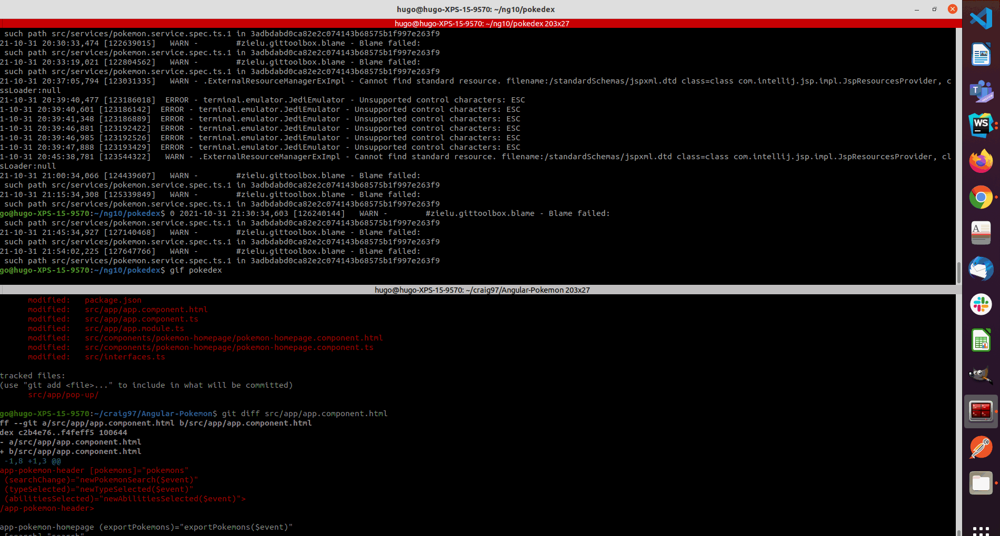

# Pokedex

This project was generated with [Angular CLI](https://github.com/angular/angular-cli) version 10.2.3.
Implementation based on Angular 10 (with material) and a piece of @ngrx/store 

## node version

Validated successfully with node 12 as a version

## Build

Run `ng build` to build the project. The build artifacts will be stored in the `dist/` directory.

## Development server

Run `ng serve` for a dev server. (Or `npm start`). Navigate to `http://localhost:4200/`. App automatically reloaded as soon as any source files gets modified

## Running unit tests

Run `ng test` (Or `npm test`) to execute the unit tests via [Karma](https://karma-runner.github.io).

